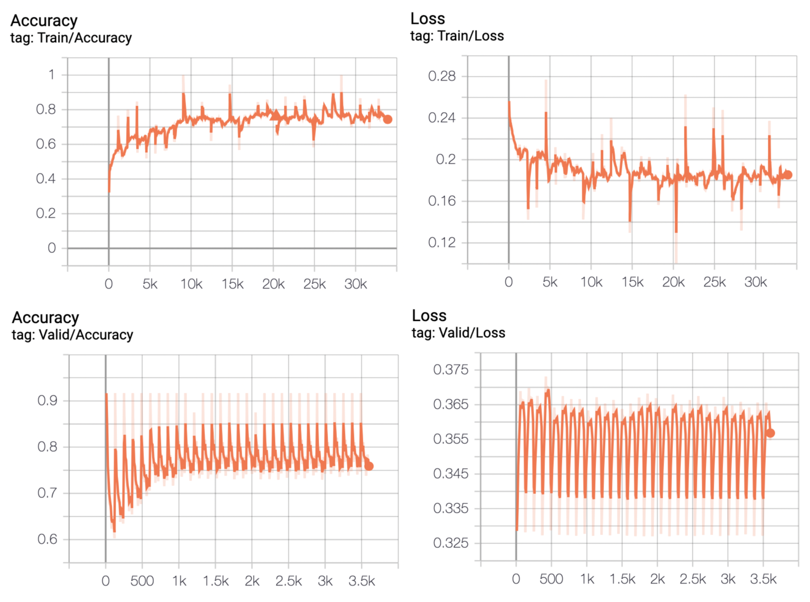
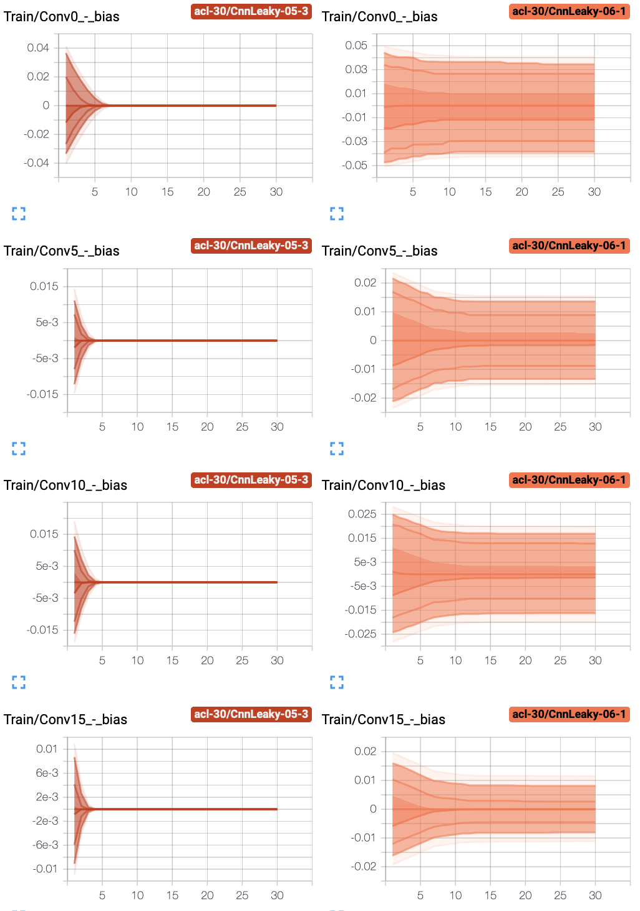

# Diagnosis for knee magnetic resonance imaging using deep convolutional neural network based on MRNet dataset

## General info
Four types of CNN model created to detect general abnormalities and specific diagnoses (anterior cruciate ligament tears and meniscal tears) on knee MRI exams published by Stanford ML Group.

## Technologies
* Python
* PyCharm Community Edition
* Anaconda (Jupyter Notebook)
* PLGrid
* PyTorch
* Torch
* Tensorboard
* Numpy
* Pandas
* Scikit-learn
* Matplotlib

<h2>Models layers</h2>

  

    
  

<h2>Model result comparision</h2>
<ul>
  <li>basic model - learning rate 0.6 - patience 3</li>
  <li>relu model - learning rate 0.5 - patience 3</li>
  <li>relu model - learning rate 0.6 - patience 3</li>
</ul>

  
  
  
 

 
<h3>Empirical distributions of bias, gradient and weight</h3>

  
  
  
 

<h3>Histograms of bias, gradient and weight</h3> 

  
  
  

<h2>Model result comparision</h2>
<ul>
  <li>leaky model - learning rate 0.5 - patience 3</li>
  <li>leaky model - learning rate 0.6 - patience 1</li>
</ul>

  
  
 

 
 <h3>Empirical distributions of bias, gradient and weight</h3>

  
  
  
 

 
 <h3>Histograms of bias, gradient and weight</h3> 

  
  
  

<h2>Models accuracy and loss</h2>

  
  

